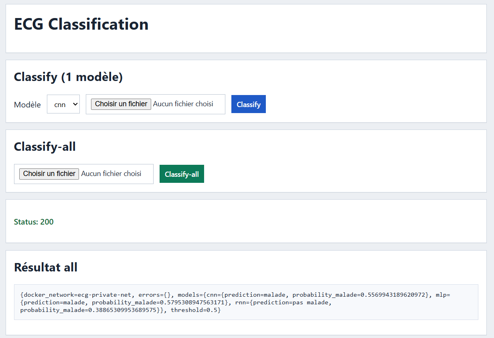

# Deep-Learning-Cardiology-Service
Ce projet est un système de détection d'infarctus développé pour un service de cardiologie. L'objectif est de comparer trois types d'architectures (**MLP**, **CNN** et **RNN**) sur le dataset **ECG200**.

##  Structure du projet

* **`core/data_loader.py`** : Charge les données ECG200, nettoie les labels (0/1) et normalise les signaux. Le code s'appuie sur la méthodologie vue en cours et en TD avec M. Devanne.
* **`models/`** : Contient les squelettes pour chaque architecture. Il suffit de compléter le modèle dans le fichier correspondant :
    * `mlp.py` 
    * `cnn.py` 
    * `rnn.py` 
* **`main.py`** : Point d'entrée unique du projet. Il gère l'entraînement, l'évaluation et la génération des graphiques de résultats.
* **`data/`** : Dossier où sont stockés les fichiers `.tsv` du dataset.
* **`production/`** : Section dédiée au TP de **M. Hassenforder**. Contient la partie **DevOps** (Docker, API, Maven) pour préparer le déploiement.

## Comment l'utiliser ?

1. **Ton modèle** : Remplis le fichier correspondant dans le dossier `models/`. Pense à bien conserver le nom de la fonction et le format d'entrée (*input*).

2. **Test** : Dans `main.py`, tout en bas, décommente la ligne de ton modèle 
(ex: `run_experiment("cnn")`).

3. **Run** : Lance la commande `python main.py` dans ton terminal.

##  Utilisation de l'IA

Conformément aux consignes du prof,j'ai utilisé un peu l'IA pour gagner du temps et pour m'aider à :
* Aide à la conception de l'architecture modulaire et génération des fonctions répétitives de visualisation (plots Matplotlib) dans le main.py.
* Rédaction (La forme) : L'IA a aidé à organiser le rapport, gérer le LaTeX et améliorer le style pour gagner du temps sur la mise en forme.

## Screenshot production

